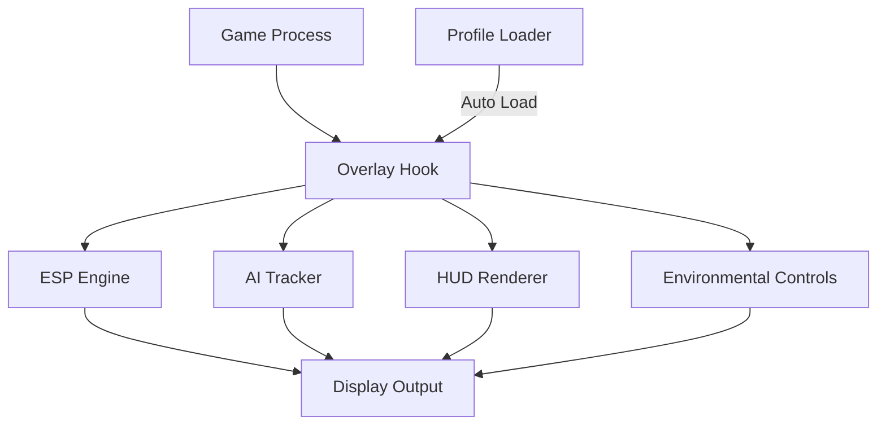

# DEVOUR Mod Menu 👁️‍🔥

Step into the cult’s darkness — this time, fully prepared. The **DEVOUR Mod Menu** gives you deep, real-time control over visibility, stamina, AI behavior tracking, and environment cues. Designed for both solo explorers and co-op veterans, it enhances clarity and tactical awareness without breaking immersion or altering save files.

Every second counts when the cult is after you — this tool ensures you always know *where to run and when to fight*.

---

## 🧭 Overview

The Mod Menu runs as an **external overlay system** that synchronizes with DEVOUR’s horror engine, reading visual layers, player metrics, and AI pathing patterns live. From ESP entity visualization to infinite stamina and environmental awareness, it provides an adaptive layer of control and safety.

No memory editing, no file injection — just pure, stable overlay technology.

---

## 💀 Core Modules

* **👁 ESP Vision:** Detect cultists, ritual items, and goats through obstacles.
* **⚡ Infinite Stamina:** Run indefinitely without exhaustion.
* **🧠 AI Awareness System:** Display active enemy positions, alert radii, and movement trails.
* **📡 Radar Overlay:** Dynamic minimap of entities, teammates, and objectives.
* **🪔 Ritual Assistant:** Highlights key ritual zones and remaining offering counts.
* **🕹 Custom Config Profiles:** Save your setups (`.devmod` format) — from *Solo Scout* to *Full Squad*.
* **🔦 Environmental Control:** Adjust lighting, fog density, and field of view for visibility advantage.

[!IMPORTANT]
Always enable **Borderless Windowed Mode** before launching the Mod Menu — it ensures full compatibility with overlay rendering.

---

## ⚙️ Compatibility

| Component          | Status | Notes                    |
| ------------------ | :----: | ------------------------ |
| Windows 10         |    ✅   | Optimized for DX11       |
| Windows 11         |    ✅   | DX12 performance stable  |
| Steam Edition      |    ✅   | Auto attach supported    |
| Epic Games Edition |    ✅   | Manual attach required   |
| Vulkan Mode        |   ⚠️   | Beta with `--vk-hook=on` |
| Cloud/VR           |    ❌   | Not supported            |

> 💡 *Accessibility:* Supports font scaling, dark mode UI, and colorblind presets for red/green contrast.

---

## ⚡ Setup Instructions

1. **Extract** the mod menu to a short path (e.g., `C:\DEVOURMod`).
2. **Start DEVOUR** normally and wait for the main menu.
3. **Run the executable:**

   ```bash
   DEVOURModMenu.exe --attach --safe
   ```
4. **Open the panel** in-game with **F8**.
5. Toggle modules on/off or load a saved `.devmod` profile.

**Example Advanced Launch:**

```bash
DEVOURModMenu.exe --profile=SoloScout --frametime-sync --dx=12
```

[!NOTE]
The first initialization may take 3–5 seconds as the overlay hooks to the render pipeline.

---

## 🧩 Config Presets

**1. Solo Scout Mode**

```ini
[esp]
enabled=true
outline_width=1.2
enemy_color=#FF4040
ally_color=#40BFFF
ritual_items=on
ai_trail=on
```

**2. Co-op Support Mode**

```ini
[team]
teammate_markers=true
audio_ping=on
safe_zone_radius=10
stamina=infinite
map_radar=on
```

**3. Night Vision Profile**

```ini
[visuals]
brightness=1.5
fog_density=0.3
color_tint=green
hud_opacity=0.8
```

---

## 📊 System Flow



Each module operates asynchronously to maintain frame stability — even during chaotic chases or ritual sequences.

---

## ❓ FAQ

**Q1: Does this affect multiplayer saves?**
A: No — everything runs externally and resets when you close the app.

**Q2: Can I hide the ESP temporarily?**
A: Yes. Press **CapsLock (hold)** for instant “clean mode.”

**Q3: Is it compatible with new DEVOUR maps?**
A: Yes — modules auto-adapt to new stage data after updates.

**Q4: Why does the overlay disappear after alt-tabbing?**
A: Toggle “Always-on-top” in Settings or press **Shift + F9** to reattach.

**Q5: Can I use controller input?**
A: Absolutely. The Mod Menu supports full XInput mapping for hotkey toggles.

---

## 🧩 Recommended Profiles

* **Solo Scout:** ESP + AI Awareness + Infinite Stamina.
* **Team Leader:** Map Radar + Ritual Assistant + Audio Pings.
* **Night Watch:** Reduced fog, bright tint, stealth markers only.

---

## 👁 Final Thoughts

The **DEVOUR Mod Menu** turns chaos into clarity. Whether you’re mastering every map, coordinating your squad, or surviving the cult’s wrath solo, this modular control system gives you an edge through pure visibility and awareness — no unfair modifications, just intelligent support.

